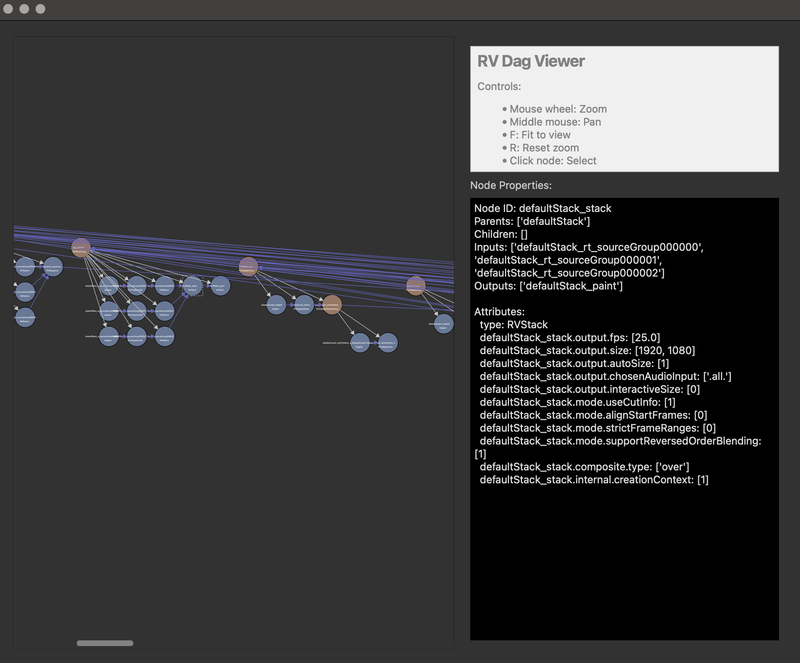

# RVDagViewer

This is a openRV plugin for viewing the DAG network within OpenRV.

The dagViewer.py code is designed to be somewhat portable, with a interface class that allows it to be easily mapped to other frameworks.

This is an example screenshot when run from RV.

## Install

You can use the dagviewer.zip to install directly into RV and OpenRV using the Preferences/Packages -> "Add Packages" button.

This has been tested with a fairly recent version of RV and OpenRV (2025).
